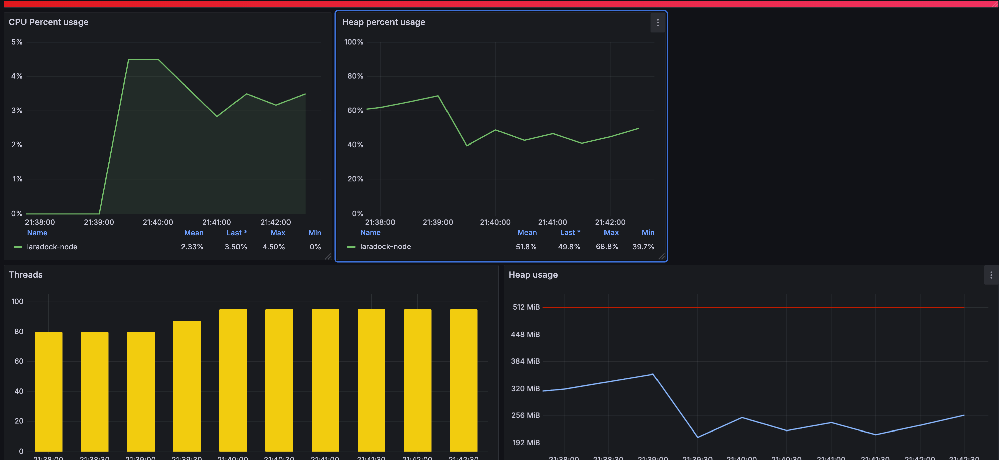
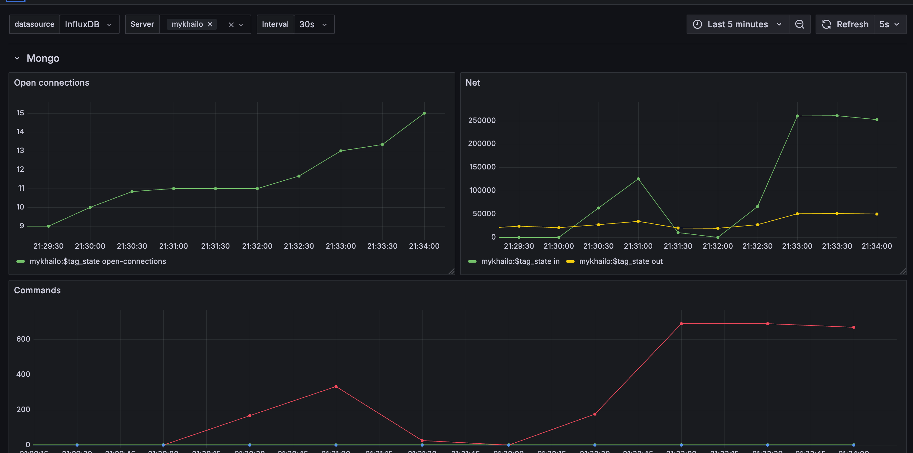
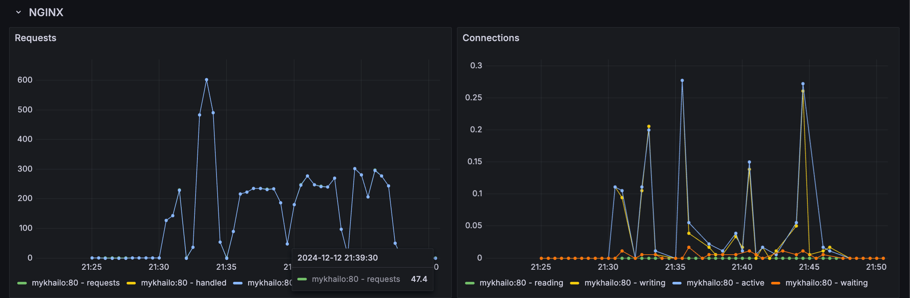
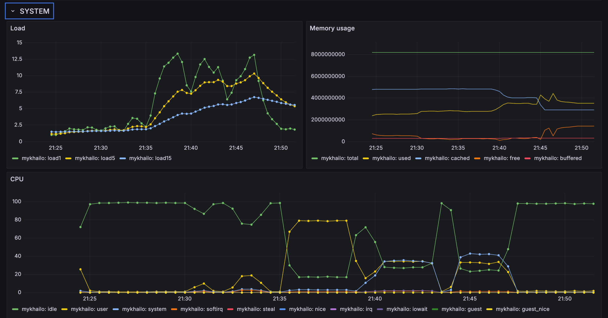

# Example Docker Compose Project for Telegraf, InfluxDB, Grafana, ASP.NET Core, Nginx, Elasticsearch, and MongoDB

This project demonstrates the use of the TIG (Telegraf, InfluxDB, and Grafana) stack along with an ASP.NET Core service, Nginx, Elasticsearch, and MongoDB.

## Prerequisites

- Docker
- Docker Compose

## Configuration

### Environment Variables

The `config.env` file contains the environment variables for the services:

```env
# Grafana options
GF_SECURITY_ADMIN_USER=admin
GF_SECURITY_ADMIN_PASSWORD=admin
GF_INSTALL_PLUGINS=grafana-piechart-panel

# InfluxDB options
INFLUXDB_DB=influx
INFLUXDB_ADMIN_USER=admin
INFLUXDB_ADMIN_PASSWORD=admin

# MongoDB options 
MONGODB_PORT=27017
MONGO_USERNAME=root
MONGO_PASSWORD=example

# Mongo Express 
MONGOEXPRESS_LOGIN=dev
MONGOEXPRESS_PASSWORD=dev

# Elasticsearch options
ELK_VERSION=8.16.1
ELASTICSEARCH_HOST_HTTP_PORT=9200
ELASTICSEARCH_HOST_TRANSPORT_PORT=9300
```

## Start the Stack with Docker Compose

To start the entire stack, rename `config.env` to `.env` and run:

```bash
$ docker-compose up
```

## Services and Ports

### Grafana
- URL: http://localhost:3000 
- User: admin 
- Password: admin 

### Telegraf
- Port: 8125 UDP (StatsD input)

### InfluxDB
- Port: 8086 (HTTP API)
- User: admin 
- Password: admin 
- Database: influx

### MongoDB
- Port: 27017
- User: root
- Password: example

### Elasticsearch
- HTTP Port: 9200
- Transport Port: 9300

## ASP.NET Core Service

The ASP.NET Core service is located in the `service-demo` directory. It connects to MongoDB and Elasticsearch and provides endpoints to populate and search data.

### Endpoints

- `/`: Returns "Hello World!"
- `/healthcheck`: Returns HTTP 200 OK
- `/mongo/populate`: Populates MongoDB with random employee data
- `/mongo/search`: Searches MongoDB for employees with a random first name
- `/elastic/populate`: Populates Elasticsearch with random employee data
- `/elastic/search`: Searches Elasticsearch for employees with a random first name

script that I used to load the system
 ```ab -t 350 -c 10 http://localhost:8000/app/{endpoint}``` 


### mongo/populate endpoint results
```
Document Path:          /app/mongo/populate
Document Length:        3 bytes

Concurrency Level:      10
Time taken for tests:   83.711 seconds
Complete requests:      50000
Failed requests:        1
   (Connect: 0, Receive: 0, Length: 1, Exceptions: 0)
Non-2xx responses:      1
Total transferred:      7349988 bytes
HTML transferred:       149997 bytes
Requests per second:    597.30 [#/sec] (mean)
Time per request:       16.742 [ms] (mean)
Time per request:       1.674 [ms] (mean, across all concurrent requests)
Transfer rate:          85.74 [Kbytes/sec] received

Connection Times (ms)
              min  mean[+/-sd] median   max
Connect:        0    0   0.1      0       6
Processing:     3   17   3.5     16     105
Waiting:        3   17   3.5     16     105
Total:          3   17   3.5     16     105

Percentage of the requests served within a certain time (ms)
  50%     16
  66%     16
  75%     17
  80%     18
  90%     19
  95%     21
  98%     28
  99%     32
 100%    105 (longest request)
```

### mongo/search endpoint results
```
Document Path:          /app/mongo/search
Document Length:        5060 bytes

Concurrency Level:      10
Time taken for tests:   218.180 seconds
Complete requests:      50000
Failed requests:        49969
   (Connect: 0, Receive: 0, Length: 49969, Exceptions: 0)
Non-2xx responses:      61
Total transferred:      1679947067 bytes
HTML transferred:       1672747616 bytes
Requests per second:    229.17 [#/sec] (mean)
Time per request:       43.636 [ms] (mean)
Time per request:       4.364 [ms] (mean, across all concurrent requests)
Transfer rate:          7519.35 [Kbytes/sec] received

Connection Times (ms)
              min  mean[+/-sd] median   max
Connect:        0    0   0.0      0       7
Processing:     2   44  12.1     42     300
Waiting:        2   43  12.0     42     285
Total:          2   44  12.1     42     300

Percentage of the requests served within a certain time (ms)
  50%     42
  66%     46
  75%     49
  80%     51
  90%     57
  95%     63
  98%     72
  99%     80
 100%    300 (longest request)
```

### elastic/populate endpoint results
```
Server Software:        nginx/1.26.2
Server Hostname:        localhost
Server Port:            8000

Document Path:          /app/elastic/populate
Document Length:        3 bytes

Concurrency Level:      10
Time taken for tests:   193.124 seconds
Complete requests:      50000
Failed requests:        0
Total transferred:      7350000 bytes
HTML transferred:       150000 bytes
Requests per second:    258.90 [#/sec] (mean)
Time per request:       38.625 [ms] (mean)
Time per request:       3.862 [ms] (mean, across all concurrent requests)
Transfer rate:          37.17 [Kbytes/sec] received

Connection Times (ms)
              min  mean[+/-sd] median   max
Connect:        0    0   0.0      0       3
Processing:    11   38  19.7     35     609
Waiting:       11   38  19.7     35     609
Total:         11   39  19.7     35     609

Percentage of the requests served within a certain time (ms)
  50%     35
  66%     40
  75%     44
  80%     47
  90%     54
  95%     64
  98%     82
  99%     99
 100%    609 (longest request)
```

### elastic/search endpoint results
```
Server Software:        nginx/1.26.2
Server Hostname:        localhost
Server Port:            8000

Document Path:          /app/elastic/search
Document Length:        2312 bytes

Concurrency Level:      10
Time taken for tests:   173.791 seconds
Complete requests:      50000
Failed requests:        49861
   (Connect: 0, Receive: 0, Length: 49861, Exceptions: 0)
Non-2xx responses:      65
Total transferred:      126269838 bytes
HTML transferred:       119070423 bytes
Requests per second:    287.70 [#/sec] (mean)
Time per request:       34.758 [ms] (mean)
Time per request:       3.476 [ms] (mean, across all concurrent requests)
Transfer rate:          709.53 [Kbytes/sec] received

Connection Times (ms)
              min  mean[+/-sd] median   max
Connect:        0    0   0.0      0       3
Processing:     3   35  21.4     30     496
Waiting:        3   34  21.4     30     496
Total:          3   35  21.4     30     496

Percentage of the requests served within a certain time (ms)
  50%     30
  66%     36
  75%     41
  80%     44
  90%     54
  95%     68
  98%     93
  99%    120
 100%    496 (longest request)
```




