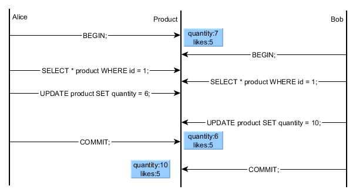

# HSA. Homework10. Transactions, Isolations, Locks

The goal of the project is to investigate common isolation problems
in MySql and PostgreSql on different isolation levels

Investigated problems:
* Dirty Read
* Non-repeatable Reads
* Phantom Reads
* Lost update


## Dirty Read

A dirty read occurs when a transaction retrieves
a row that has been updated by another transaction that is not yet committed.

<table>
<tr>
<th> Transaction 1 </th>
<th> Transaction 2 </th>
</tr>
<tr>
<td>

```sql
START TRANSACTION;
select age
from users
WHERE id = 1;
-- retrieves 20
```

</td>
<td>
</td>
</tr>
<tr>
<td></td>
<td>

```sql
START TRANSACTION;
UPDATE users
SET age = 21
WHERE id = 1;
```

</td>
</tr>
<tr>
<td>

```sql
SELECT age
FROM users
WHERE id = 1;
-- retrieves 21 in Read Uncommitted 
```

</td>
<td>
</td>
</tr>
</table>

## Non-repeatable Reads

A non-repeatable read occurs when a transaction retrieves a row twice and that
row is updated by another transaction that is committed in between.

<table>
<tr>
<th> Transaction 1 </th>
<th> Transaction 2 </th>
</tr>
<tr>
<td>

```sql
START TRANSACTION;
SELECT age
FROM users
WHERE id = 1;
-- retrieves 20
```

</td>
<td>
</td>
</tr>
<tr>
<td></td>
<td>

```sql
START TRANSACTION;
UPDATE users
SET age = 21
WHERE id = 1;
COMMIT;
```

</td>
</tr>
<tr>
<td>

```sql
SELECT age
FROM users
WHERE name = "Alice";
-- retrieves 21 when:
--   Read Uncommitted
--   Read Committed
```

</td>
<td>
</td>
</tr>
</table>

## Phantom Reads

A phantom read occurs when a transaction retrieves a set of rows twice and new rows are inserted into or removed from
that set by another transaction that is committed in between.

<table>
<tr>
<th> Transaction 1 </th>
<th> Transaction 2 </th>
</tr>
<tr>
<td>

```sql
START TRANSACTION;
SELECT name
FROM users
WHERE age > 17;
-- retrieves Alice and Bob
```

</td>
<td>
</td>
</tr>
<tr>
<td></td>
<td>

```sql
START TRANSACTION;
INSERT INTO users(name, age)
VALUES ("Carol", 26);
COMMIT;
```

</td>
</tr>
<tr>
<td>

```sql
SELECT name
FROM users
WHERE age > 17;
-- retrieves Alice, Bob and Carl when:
--   Read Uncommitted
--   Read Committed
```

</td>
<td>
</td>
</tr>
</table>


## Lost Update

Lost updates occur when two or more users try to update the same data, and the last update overwrites updates made by the previous user.

### 1 solution.

<table>
<tr>
<th> Transaction 1 </th>
<th> Transaction 2 </th>
</tr>
<tr>
<td>

```sql
START TRANSACTION;
SELECT age 
INTO @age 
FROM users WHERE id = 1;
-- retrieves 20
```

</td>
<td>
</td>
</tr>
<tr>
<td></td>
<td>

```sql
START TRANSACTION;
SELECT age 
INTO @age
FROM users WHERE id = 1;

UPDATE users
SET age = @age + 5
WHERE id = 1; 
COMMIT;
```

</td>
</tr>
<tr>
<td>

```sql
UPDATE users 
SET age = @age + 2 
WHERE id = 1;
COMMIT;
-- retrieves 22 when:
--   Read Uncommitted
--   Read Committed
--   Repeatable Read;

--   Deadlock for Searializable
```

</td>
<td>
</td>
</tr>
</table>

### 2 solution.


<table>
<tr>
<th> Transaction 1 </th>
<th> Transaction 2 </th>
</tr>
<tr>
<td>

```sql
START TRANSACTION;
SELECT age
FROM users
WHERE id = 1;
-- retrieves 20
```

</td>
<td>
</td>
</tr>
<tr>
<td></td>
<td>

```sql
START TRANSACTION;

SELECT age
FROM users 
WHERE id = 1;
```

</td>
</tr>
<tr>
<td>

```sql
UPDATE users
SET age = age + 2
WHERE id = 1;
```

</td>
<td>
</td>
</tr>
<td></td>
<td>

```sql
UPDATE users
SET age = age + 5
WHERE id = 1;
-- Expected 27

-- Serializable (deadlock)
```

</td>
</tr>

</table>

### MySQL

|                  | Dirty Read                                    | Non-repeatable Reads                          | Phantom Reads                     | Lost Update  Option 1                   | Lost Update Option 2                    |
|------------------|-----------------------------------------------|-----------------------------------------------|-----------------------------------------------|-----------------------------------------------|-----------------------------------------------|
| Read Uncommitted | <span>**yes**</span> | <span>**yes**</span> | <span>**yes**</span> | <span>**yes**</span> | <span>no</span> |
| Read Committed   | <span>no</span>      | <span>**yes**</span> | <span>**yes**</span> | <span>**yes**</span> |<span>no</span> |
| Repeatable Read  | <span>no</span>      | <span >no</span>      | <span >no</span>      | <span>**yes**</span> |<span>no</span> |
| Serializable     | <span>no</span>      | <span >no</span>      | <span >no</span>      | <span >**deadlock**</span>      |<span>**deadlock**</span> |

### PostgreSQL

|                 | Dirty Read                               | Non-repeatable Reads                          | Phantom Reads                      | Lost Update  Option 1                    | Lost Update Option 2                    |
|-----------------|------------------------------------------|-----------------------------------------------|-----------------------------------------------|-----------------------------------------------|-----------------------------------------------|
| Read Committed  | <span >no</span> | <span>**yes**</span> | <span>**yes**</span> | <span>N/A</span> | <span>No</span> |
| Repeatable Read | <span >no</span> | <span >no</span>      | <span >no</span>      | <span >N/A</span>      |<span>No</span> |
| Serializable    | <span >no</span> | <span >no</span>      | <span >no</span>      | <span >N/A</span>      |<span>No</span> |
