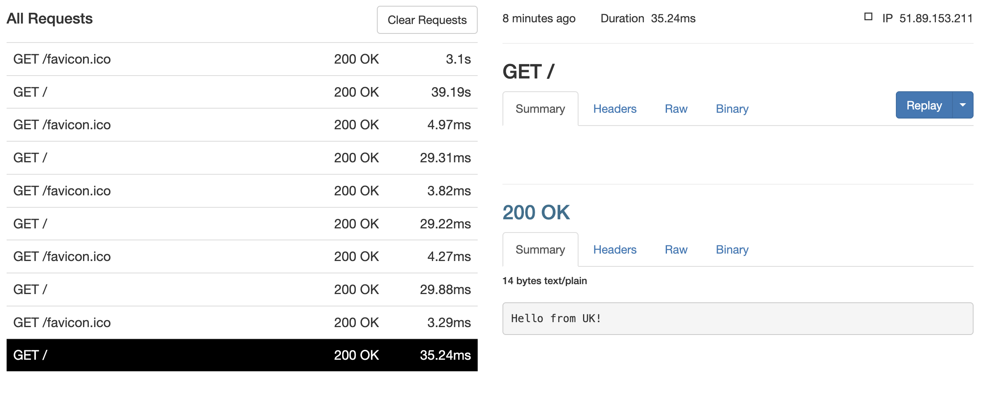
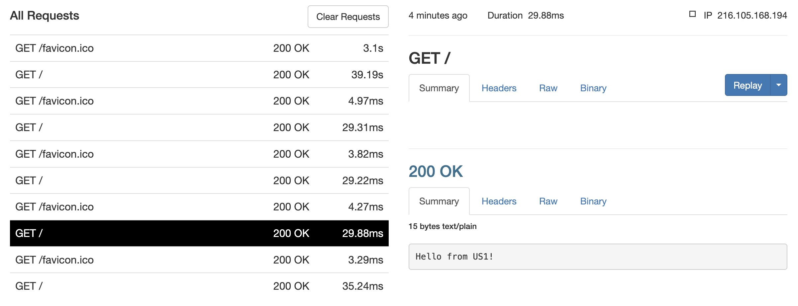
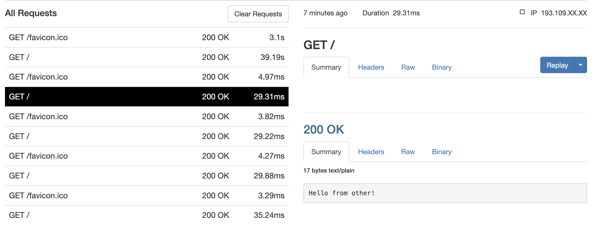
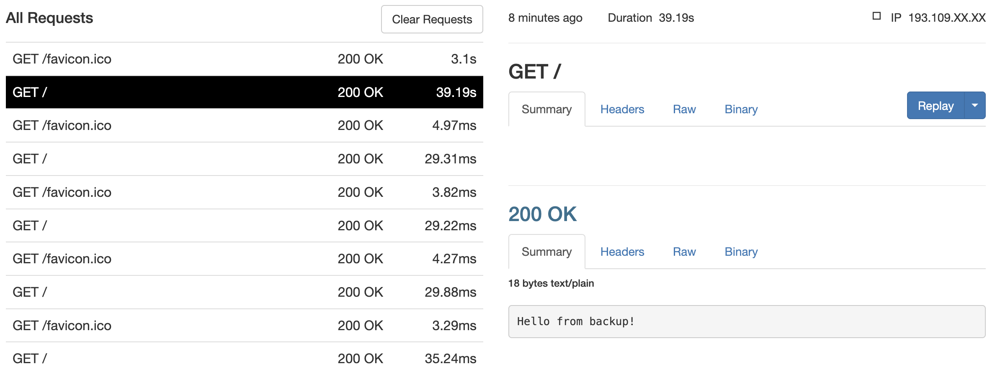

Set up load balancer on nginx that will have 1 server for UK, 2 servers
for US, and 1 server for the rest. In case of failure, it should send
all traffic to backup server. Health check should happen every 5 seconds

# Preparation

1.  Install ngrok \`brew install ngrok/ngrok/ngrok\`
2.  Install chrome extension \`Touch VPN\`

# Test

1.  Set location to UK
    

2.  Set location to US
    

3.  Turn off VPN (ip is anonymised on pictures)
    

4.  Made servers for non-UK and non-US countries unavailable 
    