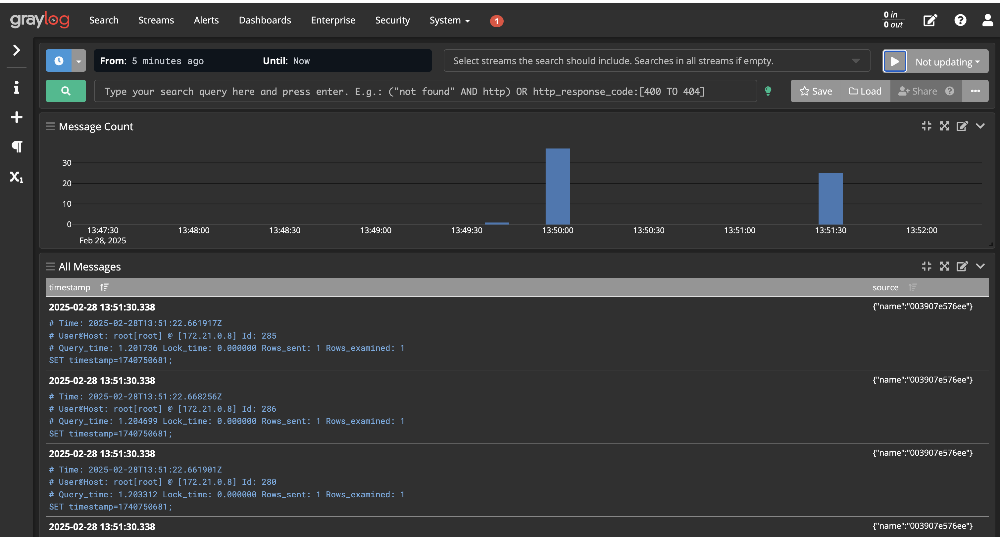
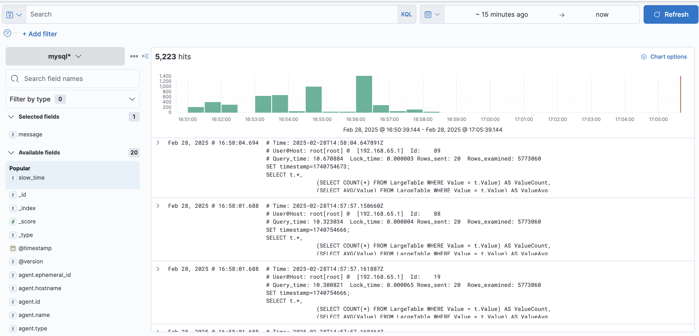

# Mysql Slow Query Log

### Test

1.  **Graylog**
    

2.  **Kibana**
    

| Parameter | Transactions (hits) | Elapsed Time (secs) | Data Transferred (MB) | Avg Response Time (ms) | Transaction Rate (trans/sec) | Throughput (MB/sec) | Concurrency | Longest Transaction (ms) | Shortest Transaction (ms) |
|-----------|---------------------|---------------------|-----------------------|------------------------|------------------------------|---------------------|-------------|--------------------------|---------------------------|
| 1         | 393                 | 30.77               | 0.88                  | 7128.04                | 12.77                        | 0.03                | 91.04       | 9370.00                  | 2570.00                   |
| 0         | 338                 | 30.25               | 0.75                  | 7767.43                | 11.17                        | 0.02                | 86.79       | 11130.00                 | 2200.00                   |
| 10        | 356                 | 30.02               | 0.79                  | 7360.31                | 11.86                        | 0.03                | 87.28       | 10410.00                 | 3070.00                   |