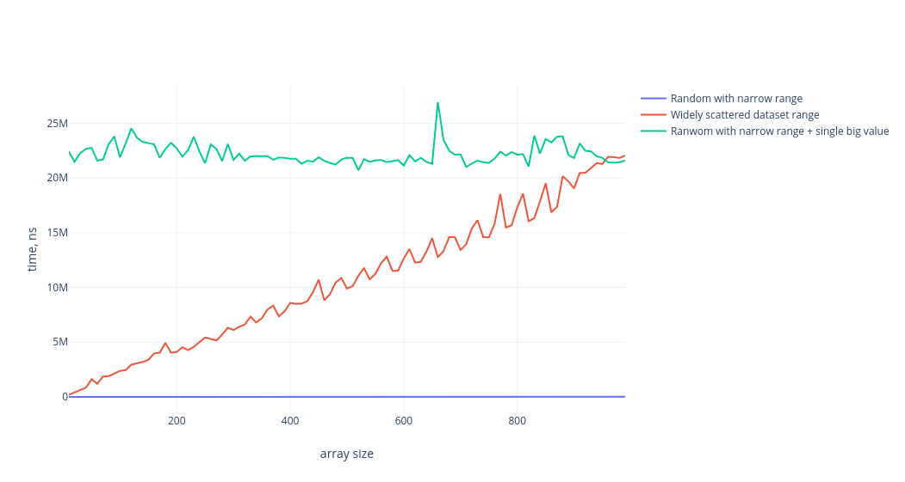

# BST and Counting Sort
## Binary Search Tree
### Test

1.  **Binary tree overview**
    
2.  **Binary tree Find operation**
  
3. **Binary tree Insert operation**
    
4. **Binary tree Delete operation**
    

## Counting Sort
### Test


For testing counting sort algorithm, I have used the following arrays:
1.  **Random array of i * 10 elements, where i is step, and values of array are** ``` 1 <= value <= i * 10```. We can see that counting sort is stable and has linear time complexity if we have a limited range of values.
    
2. **Random array (as previous one) but with one big element (I used 10_000_000)**
3. **Widely scattered dataset, where each next element is in +10_000 bigger than previous one**

We can see that how counting sort is not efficient for widely scattered dataset, because it has to allocate a lot of memory for counting array.
