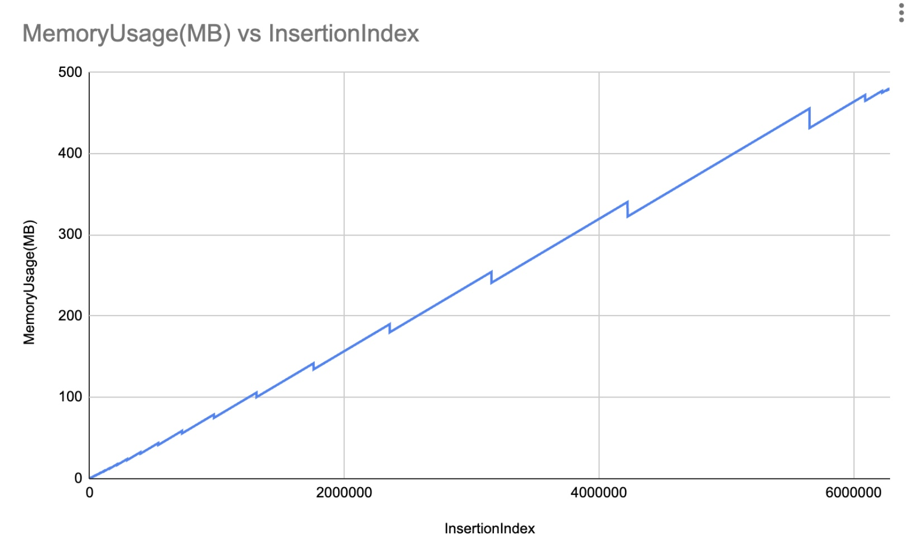
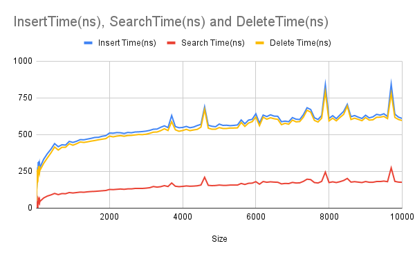

# Operation Tree Profiling

1. Implement Balanced Binary Search Tree class and operations of insert/delete/search.
2. Profile space usage (Confirm that you see O (n) )
3. Profile time consumption ( Confirm that you see O (log n))

### Space Usage
I used a method for retrieving the total memory of the application:
`GC.GetTotalMemory(true);`. This is why the graph appears slightly zigzagged.

### Time Consumption

