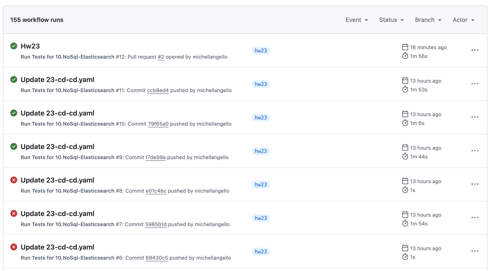
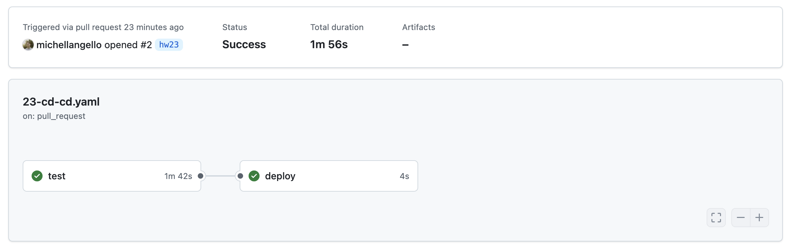
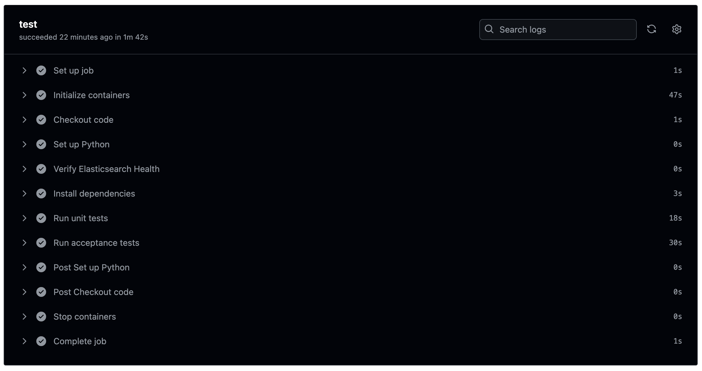

# CI/CD for Search

Setup CI/CD for your pet project or project based on laradock

## Solution

[Github actions file](../.github/workflows/23-cd-cd.yaml)

This GitHub Actions workflow automates the testing and deployment process for the `10.NoSql-Elasticsearch` project. It includes:
- Setting up an Elasticsearch service.
- Running unit and acceptance tests.
- Simulating a deployment step after successful tests.

## GitHub Actions runs

