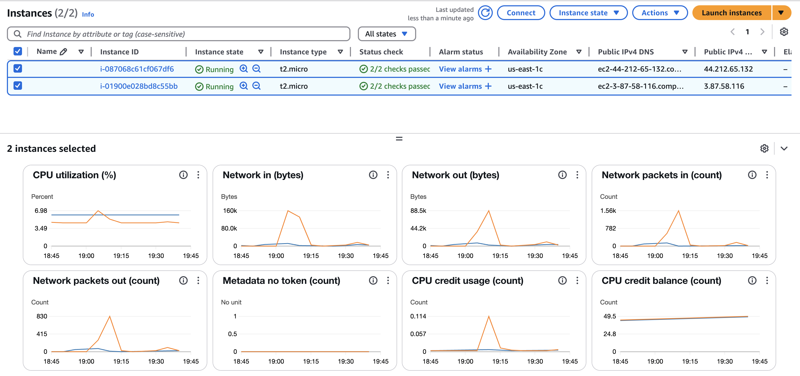
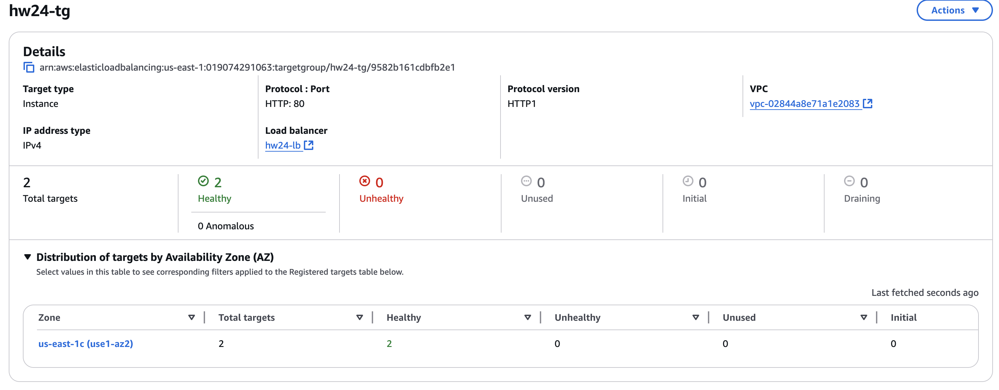
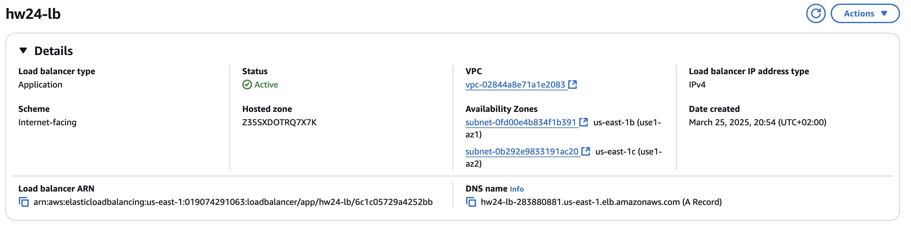
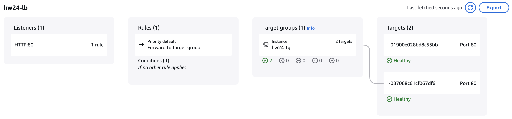

# AWS EC2 and Application Load Balancer Setup

## Task

- Create 2 micro instances in AWS.
- Setup application load balancer and assign instances to it.

## Results

### EC2 Instances

### Target Group

### Load Balancer

### Testing

#### Response from first server

#### Response from second server

