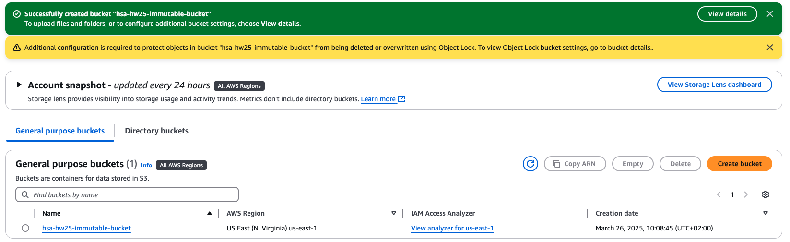
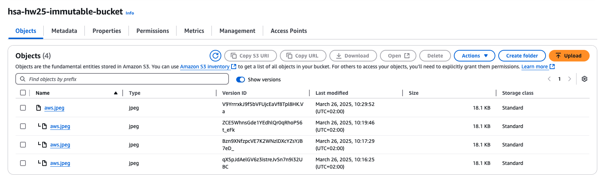
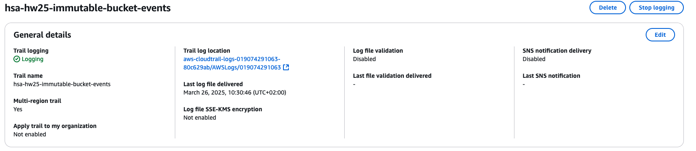
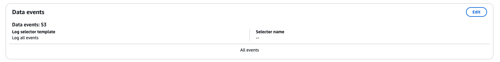

# AWS Simple Storage

## Task

- Create bucket where objects can’t be modified and all requests are logged.

## Results

### Create S3 Bucket

### Bucket versioning

### CloudTrail configuration

### Logs

