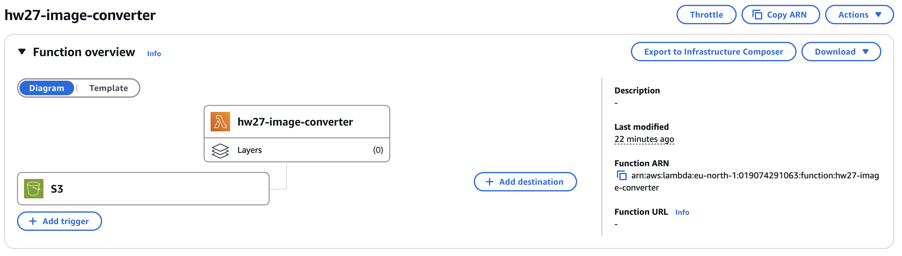
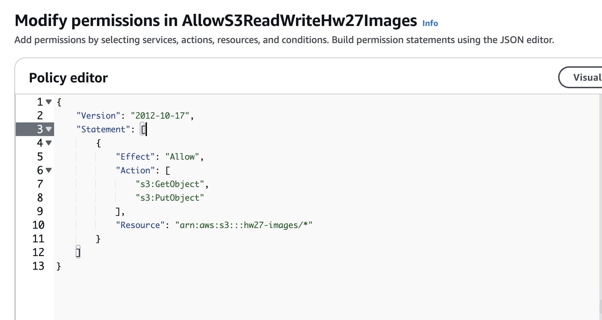
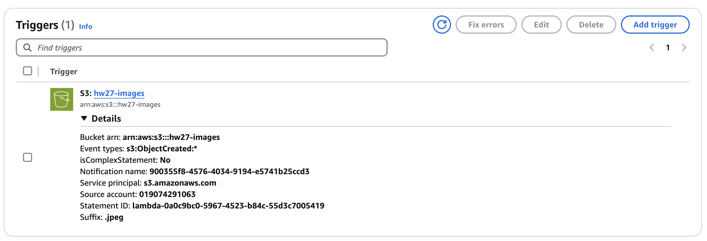
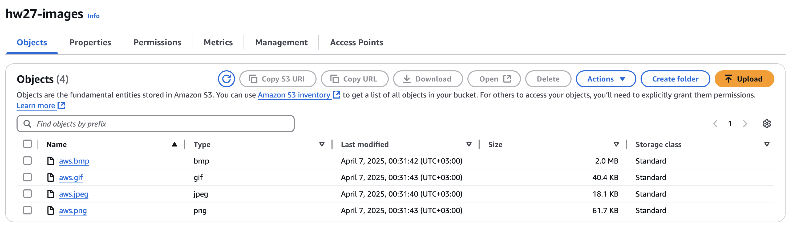

# Image Converter

## Task
 - Create Lambda function that will convert JPEG to BMP, GIF, PNG.

## Solution

1. **Create Lambda function**: Create a Lambda function using the AWS console. Add trigger for S3 bucket where the images will be uploaded. The function will be triggered when a new image is uploaded to the bucket.

2. **Add permissions to Lambda function**: 

3. **Config trigger**:

4. **Upload image and check S3**:
